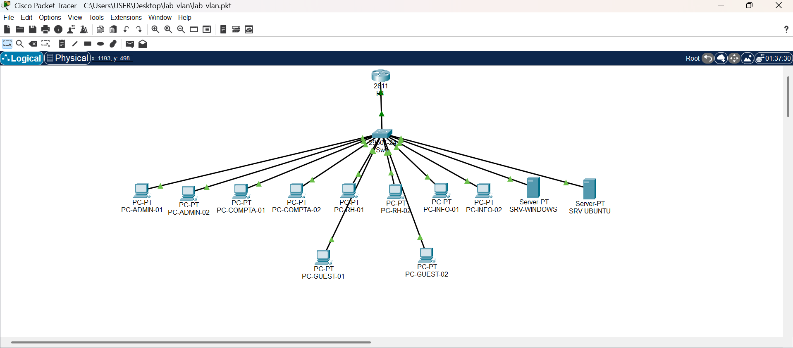
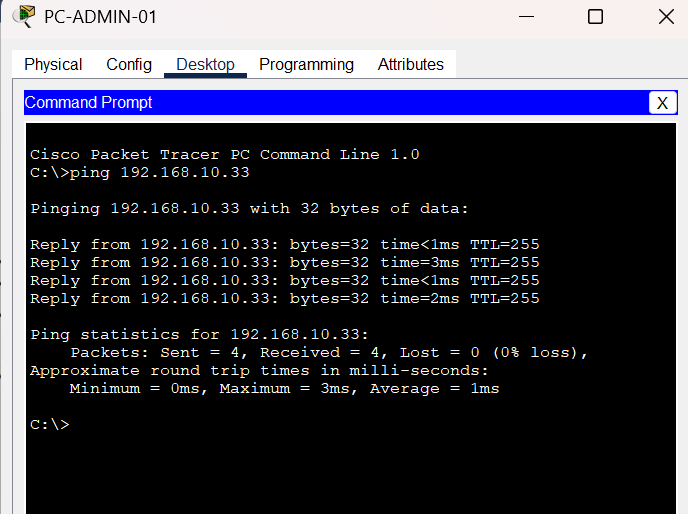

# Laboratoire réseau : VLAN, DHCP et sécurité des ports

Projet réalisé avec Cisco Packet Tracer dans le cadre de ma Licence en Génie Informatique et Télécommunications.

## Objectif
Segmenter un réseau local en plusieurs VLAN, le faire communiquer grâce au routage inter-VLAN, et le sécuriser.

## Topologie
- 1 routeur
- 1 switch
- 6 VLAN
- Plusieurs PC répartis dans les VLAN

## Ce que j'ai configuré
- Création de 6 VLAN sur le switch
- Liaison trunk entre le switch et le routeur
- Routage inter-VLAN
- Attribution automatique des adresses avec DHCP
- Sécurisation des ports du switch (port security)

## Tests
Les tests de connectivité avec la commande `ping` confirment que les VLAN communiquent entre eux.

## Fichiers du projet
- `lab-vlan.pkt` : le laboratoire Packet Tracer
- `config-routeur.txt` : configuration du routeur
- `config-switch.txt` : configuration du switch

## Outils
Cisco Packet Tracer

## Auteure
Aïssata Aliou Traoré
